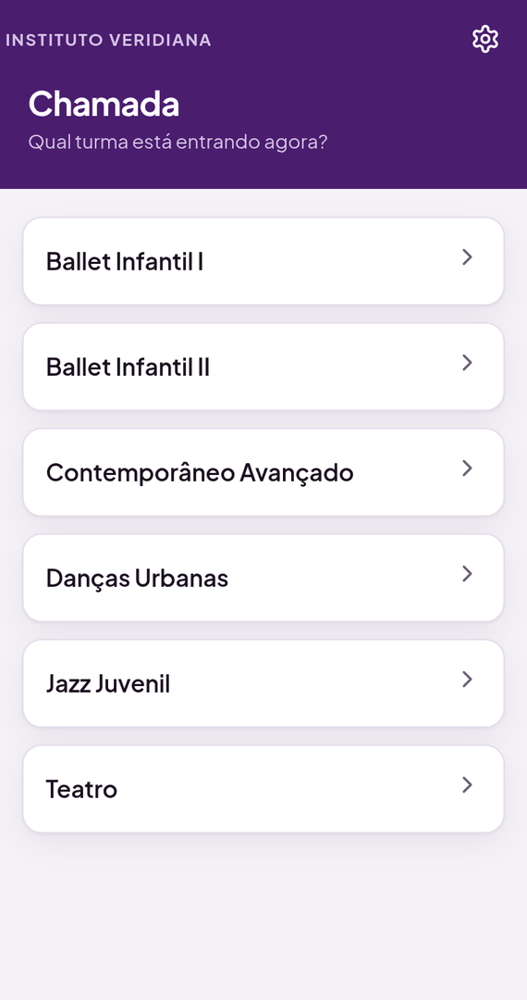

<h1 align="center">Chamada — Instituto Veridiana</h1>

<p align="center">
  Registro de frequência para um projeto social de dança no Jangurussu,
  em Fortaleza (CE).<br>
  Google Apps Script + planilha do Google. Sem servidor, sem build, sem custo.
</p>

<p align="center">
  
  
  
</p>

---

## O problema

O Instituto Veridiana atende crianças e jovens em situação de
vulnerabilidade social pelos projetos *Sonho de Dançar* (3 a 12 anos) e
*Cia Corpo Identidade* (13 a 28 anos). Cerca de 20 professores, a maioria
voluntária. O instituto se mantém com bazar, doações e editais.

A chamada era feita no papel e digitada depois — quando era digitada.
Sem registro confiável, duas coisas aconteciam:

- O instituto não conseguia **comprovar atendimento em edital**, que é de
  onde vem o dinheiro.
- Criança que parava de vir só era notada **semanas depois**, quando
  faltar já tinha virado hábito.

---

## O fluxo

Cada turma tem um QR code colado na parede da sala. O professor escaneia,
a lista abre com **todos já marcados como presentes**, ele toca só em quem
faltou, confirma o próprio nome e salva.

> **A métrica que decidiu tudo: uma turma de 20 alunos com 3 faltas em 5
> toques.** Três nos ausentes, um no professor, um em salvar. Qualquer
> proposta que aumentasse esse número foi recusada, por mais bonita que
> fosse.

<p align="center">
  
  
  
</p>

Presença é o padrão e fica silenciosa: um visto verde discreto. Falta
grita — fundo rosa, avatar vermelho, selo escrito. Numa sala barulhenta,
com o celular na mão, o olho acha as três faltas sem procurar.

---

## A entrada

O QR da parede continua abrindo **direto** na lista de chamada, sem
nenhuma tela no meio. A tela inicial só aparece para quem abre o app
sem `?turma=`: saudação, a data, um cartão com a aula que deve estar
começando (ou o evento de hoje) e a grade de seções, cada uma com um
número de verdade — "6 turmas", "R$ 1.288,20 em caixa", "127 itens".

A "próxima aula" não depende de grade de horário cadastrada: sai da hora
em que cada turma costuma ter a chamada salva, no mesmo dia da semana,
nas últimas 5 semanas.

**Link por professor.** O iframe do Apps Script não guarda nada entre
uma visita e outra, então o app sabe quem é a pessoa pelo endereço:
`.../exec?prof=Vera%20Lúcia`. A saudação usa o primeiro nome e a chamada
já vem com a professora escolhida — de 5 para 4 toques. Em **Gestão →
QR e links → Link por professor** cada um recebe o seu pelo WhatsApp.

## Agenda anual

A coordenação monta o planejamento do ano, **imprime um calendário** e
escreve nele à mão. A agenda não compete com o papel: alimenta o papel.
Lista por mês, visão do ano com a contagem de cada mês, datas fixas para
pré-carregar em janeiro, e o **calendário em PDF, A4 deitado**, uma
página por trimestre, com espaço em branco em cada dia para escrever.

Só o Dia Internacional da Dança está nas datas fixas. As demais esperam
confirmação da coordenação (`DATAS_FIXAS` em `Agenda.gs`) — lista
genérica de internet vira ruído que ela teria que limpar.

## Materiais

Estrutura fixa, categorias livres. Os campos são sempre os mesmos;
categoria e local ela cria digitando, no próprio cadastro. Atalhos com
número no topo: **para o bazar** e **precisa reparo**. Mais e menos na
ficha do item. Item descartado nunca é apagado.

Fora da v1, de propósito: histórico de quem pegou, foto, código de barras
e valor patrimonial. Cadastro lento não acontece.

## Além da chamada

### Caixa


Entrada e saída do celular, entre uma aula e outra. Dois botões grandes,
valor, categoria, salvar.

Cada lançamento carrega uma **fonte**. Não é burocracia: o instituto vive
de edital, e prestação de contas exige mostrar de qual bolso saiu cada
real. Dinheiro de edital misturado com doação num pote só é o que faz a
prestação ser recusada.

Na saída dá para **fotografar a nota na hora**. A foto é reduzida no
próprio celular antes de subir — 4 MB em 4G instável não chegam, e o
comprovante é justamente o que não pode faltar.

O resumo do período soma por categoria e por fonte, e avisa quantas
saídas estão sem nota.

<br clear="right">

<p align="center">
  
  
</p>

### Certificado de participação


Uma menina de 17 anos aqui não tem nada no papel. Sem currículo, sem
certificado, sem comprovante de nada.

O instituto tem, na planilha, o registro exato: desde quando ela vem,
quantas aulas frequentou, em quais turmas. **É o único lugar do mundo que
consegue emitir esse documento** — e até agora ele não existia.

Serve para currículo de Jovem Aprendiz, atividade complementar na escola
e comprovação de vínculo em programa social.

O PDF sai com um toque, com link pronto para mandar no WhatsApp da
família. Ou a turma inteira de uma vez, uma página por aluna, para
imprimir e entregar no fim do ano.

<br clear="right">

<p align="center">
  
  
</p>

> O certificado individual sai com link público, para o PDF abrir no
> celular da família, que não tem conta Google. O da turma inteira **não**
> — teria o nome de 20 crianças num link aberto. Esse fica só no Drive,
> para imprimir.

### Precisam de atenção


Lista quem faltou **3 aulas seguidas** da própria turma. O botão abre o
WhatsApp do responsável com a mensagem já escrita.

Três faltas consecutivas é o mesmo gatilho que a busca ativa usa na rede
pública de ensino. O dado já era coletado desde o primeiro dia — faltava
alguém ler.

Se o aluno não tem telefone cadastrado, o cartão vira um atalho para
cadastrar na hora, em vez de só informar o problema.

<br clear="right">

### Relatório para edital


Escolhe o período e sai o que a prestação de contas pede: beneficiários
únicos atendidos, aulas realizadas, frequência média e faixa etária no
recorte do ECA e do Estatuto da Juventude.

Um botão copia tudo em texto, pronto para colar no formulário do edital.

<br clear="left">

### Histórico e aniversários

<p align="center">
  
  
  
</p>

Histórico por dia e por mês, só leitura. Aniversariantes da semana no
menu, e o aniversário do dia aparece na tela da chamada — sem custar um
toque a mais. Para uma criança daqui, o instituto lembrar do aniversário
dela não é enfeite.

A área de gestão fica atrás de um código de 4 dígitos, porque o QR está
colado numa parede por onde passam adolescentes.

---

## Decisões de projeto

**A planilha continua sendo a única fonte de verdade.** Nenhum banco de
dados externo. A responsável pelo instituto lê e conserta os dados
sozinha, e o histórico de versões do Google desfaz qualquer estrago. Foi
por isso que Supabase e Firebase foram descartados: tiram o dado de onde
ela sabe mexer, e o plano gratuito do Supabase ainda pausa o projeto
depois de 7 dias sem acesso — férias escolares derrubariam o sistema.

**Nada de gráfico dentro do app.** O painel de frequência vive na
planilha, com Tabela Dinâmica montada pelo próprio código. Duplicar cria
duas verdades, e a do app sempre fica pior.

**Aluno nunca é apagado.** Sai da chamada virando `Ativo = NAO`, para o
histórico dele não ficar órfão.

**Sem dependência externa.** Um único CDN, o do Google Fonts, e mesmo ele
carrega sem bloquear a primeira pintura. O encoder de QR foi escrito para
este projeto e conferido contra um leitor independente: 124 textos, com
round-trip completo e síndromes Reed-Solomon zeradas em todos os blocos.

**Alvo real:** Android intermediário, 4G instável, tela de 380px,
professores sem familiaridade com tecnologia. Toda área tocável tem no
mínimo 44px.

---

## Estrutura

```
apps-script/        cole estes 23 arquivos no editor do Apps Script
  Codigo.gs           constantes, doGet, montagem da página e módulos
  Util.gs             planilha, datas, cache e trava
  Inicio.gs           números da tela inicial e "próxima aula"
  Chamada.gs          o fluxo do QR
  Gestao.gs           PIN, turmas, alunos, professores
  Planilha.gs         link, padronização, Painel e menu
  Historico.gs        leitura do histórico por mês
  Impacto.gs          evasão, relatório de edital, aniversários
  Certificado.gs      certificado em PDF com carga horária
  Caixa.gs            entradas, saídas, comprovantes e resumo
  Agenda.gs           agenda anual e calendário em PDF
  Materiais.gs        lista de materiais
  Index.html          casca da página
  Estilo.html         CSS da casca, da entrada, da chamada e da gestão
  AppNucleo.html      estado, ícones, ponte, roteador, módulos sob demanda
  AppInicio.html      tela inicial
  AppChamada.html     telas da chamada
  AppPartida.html     lê turma e professor da URL e abre a primeira tela
  AppGestao.html      telas da área da equipe          (sob demanda)
  AppCaixa.html       telas do fluxo de caixa          (sob demanda)
  AppQr.html          encoder de QR                    (sob demanda)
  AppAgenda.html      telas da agenda, com o CSS dela  (sob demanda)
  AppMateriais.html   telas de materiais, com o CSS    (sob demanda)

mock.js             mock do google.script.run, só para o navegador
gerar-preview.py    monta o preview.html
preview.html        abre no navegador, funciona sem servidor
assets/             telas do app
icones/             ícone do atalho na tela inicial
```

O `doGet` encaixa o CSS antes de `</head>` e os scripts antes de
`</body>`. Não usa template do Apps Script, então nenhum arquivo pode
conter a sequência de scriptlet.

**Peso.** A página que o `doGet` entrega leva só entrada e chamada:
73 KB (22 KB compactada), contra 126 KB de antes, quando tudo vinha junto.
Gestão, caixa, agenda e materiais chegam por `modulo()` na primeira vez
que alguém abre a seção — e a tela inicial já os baixa em segundo plano.
Quem escaneia o QR nunca baixa nenhum deles.

---

## Rodar sem instalar nada

Abra o **`preview.html`** no navegador. Ele já vem montado, com um mock do
`google.script.run` que só liga quando `window.google` não existe.

- `preview.html` — tela inicial
- `preview.html?prof=Vera%20Lúcia%20Sampaio` — atalho pessoal da professora
- `preview.html?turma=Jazz%20Juvenil` — como se viesse do QR da parede
- `preview.html?dev=1` — painel para simular 4G ruim e queda de rede
- Código da gestão no preview: **1234**

Para regerar o `preview.html` depois de mexer em `apps-script/`:

```bash
python3 gerar-preview.py
```

`python3 gerar-preview.py --lazy teste.html` monta uma versão em que os
módulos chegam pelo mock, para testar o carregamento sob demanda.

---

## 1. Colar no Apps Script

São 23 arquivos. No editor, o botão **+** ao lado de "Arquivos" cria cada um.

**Arquivos de script** (`+` → **Script**). Digite o nome sem `.gs`:

`Codigo` · `Util` · `Inicio` · `Chamada` · `Gestao` · `Planilha` · `Historico` · `Impacto` · `Certificado` · `Caixa` · `Agenda` · `Materiais`

**Arquivos de HTML** (`+` → **HTML**). Digite o nome sem `.html`:

`Index` · `Estilo` · `AppNucleo` · `AppInicio` · `AppChamada` · `AppPartida` · `AppGestao` · `AppCaixa` · `AppQr` · `AppAgenda` · `AppMateriais`

Em cada um: `Ctrl+A`, `Delete`, cole o conteúdo do arquivo de mesmo nome
da pasta `apps-script/`, `Ctrl+S`.

> A ordem dos arquivos na lista não importa. Os `.gs` dividem o mesmo
> escopo global, e o `doGet` monta o HTML chamando cada parte pelo nome.

Depois: **Implantar → Gerenciar implantações → ✏️ → Versão: Nova
versão → Implantar**. Sem isso o link continua servindo o código antigo.

> `Certificado.gs` e `Caixa.gs` usam o Drive para salvar PDF e comprovante. Na primeira vez que
> você gerar um certificado, o Google vai pedir autorização de novo —
> é o escopo do Drive entrando. Autorize e siga.
>
> O calendário para imprimir (`Agenda.gs`) monta a página num Google
> Docs temporário, porque o conversor de HTML do certificado não sabe
> fazer folha deitada. Na primeira vez o Google pede autorização para
> **Documentos**. O Docs temporário vai para a lixeira logo depois.

Na primeira vez, em **Implantar → Nova implantação → Tipo: App da Web**:

- Executar como: **Eu**
- Quem pode acessar: **Qualquer pessoa**

"Executar como: eu" é o que permite o professor fazer chamada sem ter
acesso de edição à planilha.

---

## 2. Criar o código da gestão (o "PIN")

**Não existe senha padrão.** Enquanto você não criar uma, o botão Gestão
responde *"Ainda não existe código"* — é isso que você viu.

O `1234` só vale no `preview.html`, nunca no app publicado.

Para criar:

1. Abra a **planilha** (não o editor de script).
2. Recarregue a página uma vez, para o menu **Veridiana** aparecer.
3. **Veridiana → Definir código da gestão**, digite 4 números, OK.

Se o menu não aparecer, dá para fazer pelo editor: escolha a função
`configurarPin` na barra de cima e clique em **Executar**.

O código fica nas Script Properties, nunca dentro do código-fonte.

### O que esse PIN protege, e o que não protege

Ele impede toque acidental e curiosidade de adolescente que passa perto
do QR na parede. É esse o risco real.

Ele **não** protege contra alguém determinado: trafega em texto e não tem
limite de tentativas. A rede de segurança de verdade é o histórico de
versões do Google Sheets, que desfaz qualquer estrago.

---

## 3. Ícone na tela inicial do celular

O app roda dentro de um iframe, e o "Adicionar à tela inicial" lê o ícone
da **página de fora**, que é do Google. No Android o `setFaviconUrl` do
Apps Script às vezes resolve. **No iPhone nunca resolve**: o Safari só
aceita ícone de atalho via `apple-touch-icon`, que não existe na página
do Google.

Por isso este repositório publica uma casca no **GitHub Pages**:

```
index.html      abre o app em tela cheia, com o ícone e o nome certos
manifest.json   Android
icones/         icon-180 (iOS), icon-192 e icon-512 (Android)
```

### Ligar

1. No `index.html`, coloque o link do seu app em `URL_APP`:

   ```javascript
   var URL_APP = 'https://script.google.com/macros/s/SEU_ID/exec';
   ```

2. Confirme que o `doGet` tem a linha que libera o embed — sem ela o
   iframe fica em branco:

   ```javascript
   .setXFrameOptionsMode(HtmlService.XFrameOptionsMode.ALLOWALL);
   ```

3. No GitHub: **Settings → Pages → Source: Deploy from a branch →
   `main` / `/ (root)`**.

O endereço fica `https://joaoviitorsx.github.io/Instituto_Veridiana/`.

### Instalar no celular

**iPhone:** abra no **Safari** (não funciona no Chrome do iOS) →
Compartilhar → **Adicionar à Tela de Início**.

**Android:** abra no Chrome → menu ⋮ → **Instalar aplicativo**.

O atalho abre em tela cheia, sem barra de endereço.

> O QR da parede pode continuar apontando direto para o `/exec`. Se
> preferir que passe pela casca, use
> `.../Instituto_Veridiana/?turma=Jazz%20Juvenil` — o `?turma=` é
> repassado para dentro.

## 4. QR de cada turma e link de cada professor

Tela inicial → **Gestão** → **QR e links**. Aba **QR das turmas**: escolha
a turma. Aba **Link por professor**: escolha a pessoa e mande pelo
WhatsApp; ela abre e adiciona à tela inicial do celular.

O endereço do app é descoberto sozinho. Se aparecer o aviso de que falta o
endereço, use **Veridiana → Configurar endereço do app** e cole o link que
termina em `/exec`.

O QR é gerado dentro do próprio app, sem serviço de fora. Nenhum site de
terceiro pode sair do ar e deixar você sem reimprimir o cartaz.

Para imprimir: abra a tela do QR no computador e mande imprimir. Sai só o
cartaz, no tamanho A5.

---

## 5. Abas da planilha

| Aba | Colunas |
|---|---|
| `Alunos` | Turma, Aluno, Ativo (SIM/NAO), Nascimento, Responsável, Telefone |
| `Professores` | Professor |
| `Chamadas` | Registro, Data, Turma, Professor, Aluno, Status |
| `Turmas` | Turma, Ativa (SIM/NAO), Minutos por aula |
| `Caixa` | Registro, Data, Tipo, Valor, Categoria, Descrição, Fonte, Comprovante, Quem registrou |
| `Agenda` | ID, Data, DataFim, Titulo, Tipo, Turmas, Local, Status, Observacao |
| `Materiais` | ID, Item, Categoria, Finalidade, Quantidade, Estado, Local, Observacao, Ativo |

`Chamadas`, `Turmas`, `Agenda` e `Materiais` nascem sozinhas no primeiro uso.
Linha digitada direto na planilha, sem ID, ganha um na primeira leitura.

> **Saldo na tela inicial.** A tela inicial abre sem código, e mostra o
> saldo do caixa. Se a coordenação preferir que o número fique só dentro
> do Caixa, troque `MOSTRAR_SALDO_NA_ENTRADA` para `false` em `Inicio.gs`.

`Turmas` foi acrescentada porque turma criada sem nenhum aluno não tinha
onde existir nas três abas originais, e "arquivar turma" precisa guardar
que ela saiu de circulação.

Aluno que sai **nunca** é apagado: vira `NAO` na coluna Ativo. Apagar a
linha deixa o histórico dele órfão na aba Chamadas.
